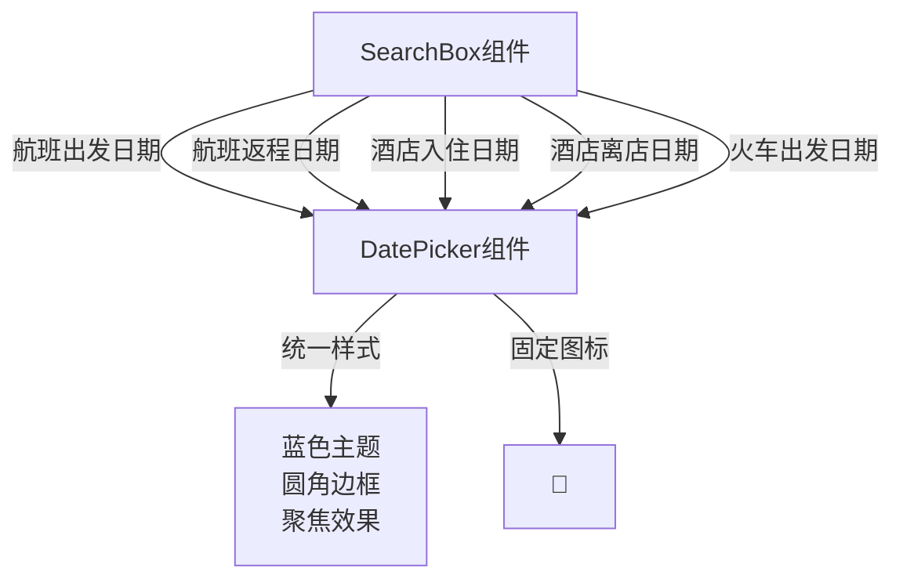

# 抽象 DatePicker 组件并全局复用

## 实施步骤

### 1. 创建 DatePicker 组件

创建新文件 `src/components/DatePicker.jsx`

**组件功能：**

- 封装日期选择输入框
- 统一样式：圆角边框、聚焦效果、悬停效果
- 固定使用📅图标
- 统一蓝色主题

**组件 Props：**

```javascript
{
  label: string,        // 标签文本，如 "出发日期"
  value: string,        // 日期值
  onChange: function,   // 变更回调
  required: boolean,    // 是否必填（默认 false）
  placeholder: string,  // 占位文本（可选）
  className: string     // 额外样式类（可选）
}
```

**样式规范：**

- 基于现有 SearchBox 中的样式
- 宽度：`w-full`
- 边框：`border-2 border-gray-200`
- 圆角：`rounded-xl`
- 聚焦：`focus:border-blue-500 focus:ring-2 focus:ring-blue-200`
- 悬停：`hover:border-gray-300`
- 图标：右侧固定📅图标

### 2. 在 SearchBox 中替换日期输入框

修改文件 [`src/components/SearchBox.jsx`](src/components/SearchBox.jsx)

**需要替换的位置（共5处）：**

1. **航班搜索 - 出发日期**（第90-104行）
2. **航班搜索 - 返程日期**（第106-121行，往返时显示）
3. **酒店搜索 - 入住日期**（第145-159行）
4. **酒店搜索 - 离店日期**（第161-175行）
5. **火车票搜索 - 出发日期**（第231-245行）

**替换示例：**

```javascript
// 替换前
<div className="relative">
  <label className="block text-sm font-semibold text-gray-700 mb-2">
    出发日期
  </label>
  <div className="relative">
    <input
      type="date"
      className="w-full px-4 py-3.5 ..."
      value={searchData.date}
      onChange={(e) => handleChange('date', e.target.value)}
      required
    />
    <span className="absolute right-4 top-1/2 -translate-y-1/2 text-blue-500">📅</span>
  </div>
</div>

// 替换后
<DatePicker
  label="出发日期"
  value={searchData.date}
  onChange={(value) => handleChange('date', value)}
  required
/>
```

### 3. 组件结构图



## 验证测试

完成后需要测试以下场景：

1. 访问首页，切换机票/酒店/火车票标签
2. 验证所有日期选择器样式一致
3. 验证必填验证（required）正常工作
4. 验证往返机票时返程日期显示/隐藏正常
5. 验证日期选择和表单提交功能正常

## 预期效果

- 代码复用：5处重复代码简化为1个组件调用
- 维护性：样式和行为统一管理
- 一致性：所有日期选择器外观和交互完全一致