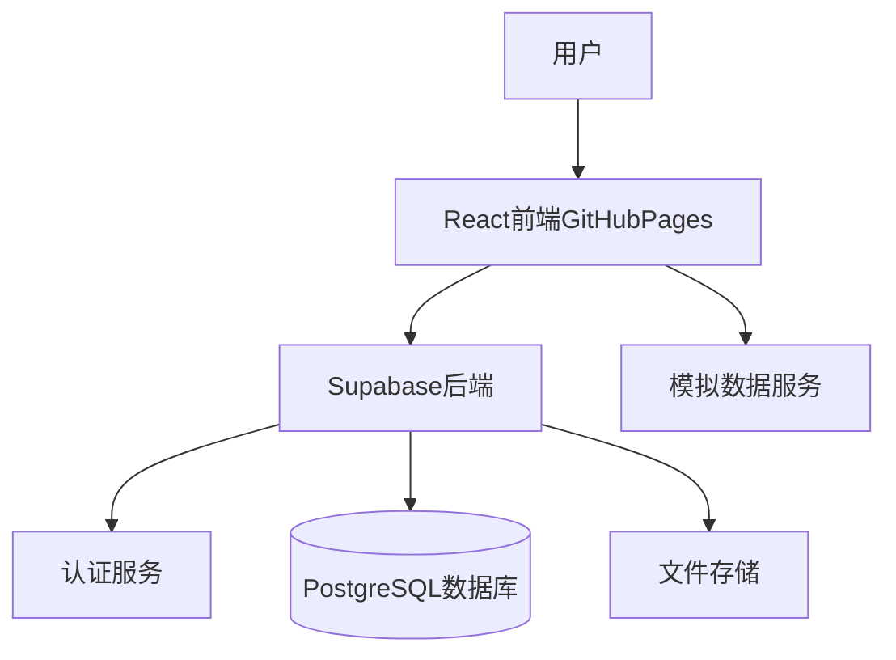

# 携程MVP克隆 - 多模块旅行预订平台

## 项目架构




## 技术栈

**前端:**

- React 18 + Vite
- React Router v6（路由）
- TailwindCSS + DaisyUI（UI组件）
- Zustand（状态管理）
- React Query（数据请求）
- Day.js（日期处理）
- Supabase Client SDK

**后端:**

- Supabase Authentication（用户认证）
- Supabase PostgreSQL（数据存储）
- Supabase Storage（图片存储）
- Row Level Security（数据安全）

**部署:**

- GitHub Pages（静态资源托管）
- GitHub Actions（自动部署）

## 核心功能模块

### 1. 首页与导航

- 顶部导航栏（机票、酒店、火车票、用户中心）
- 搜索区域（快速切换搜索类型）
- 轮播广告横幅
- 热门推荐板块

### 2. 机票模块

- **搜索功能**: 出发地/目的地、日期选择、单程/往返
- **航班列表**: 展示航班信息（航司、时间、价格、机型）
- **筛选排序**: 按价格/时间/航司筛选
- **航班详情**: 详细信息和价格明细
- **订单创建**: 填写乘客信息，创建订单

### 3. 酒店模块

- **搜索功能**: 城市、入住/离店日期、关键词
- **酒店列表**: 酒店名称、评分、价格、图片
- **筛选功能**: 价格区间、星级、设施
- **酒店详情**: 图片轮播、设施介绍、房型列表
- **预订功能**: 选择房型、填写信息

### 4. 火车票模块

- **搜索功能**: 出发站/到达站、日期选择
- **车次列表**: 车次号、时间、历时、票价、余票
- **筛选功能**: 车次类型（G/D/K/T）、出发时间段
- **订单创建**: 选择乘客、座位类型

### 5. 用户认证系统

- 注册页面（邮箱注册，Supabase Auth）
- 登录页面（邮箱+密码）
- 用户中心（个人信息、订单列表）
- 退出登录

### 6. 订单管理

- 我的订单列表（所有订单类型）
- 订单详情查看
- 订单状态（待支付、已支付、已完成、已取消）
- 模拟支付流程（仅更新状态，无真实支付）

## 数据库设计

### Supabase数据表结构

#### users（扩展表）

```sql
- id: uuid (关联 auth.users)
- nickname: text
- phone: text
- created_at: timestamp
```


#### flights（航班信息）

```sql
- id: uuid
- flight_number: text
- airline: text
- departure_city: text
- arrival_city: text
- departure_airport: text
- arrival_airport: text
- departure_time: timestamp
- arrival_time: timestamp
- price: decimal
- aircraft_type: text
- available_seats: integer
```


#### hotels（酒店信息）

```sql
- id: uuid
- name: text
- city: text
- address: text
- star_rating: integer
- rating_score: decimal
- price_start: decimal
- images: jsonb
- facilities: text[]
- description: text
```


#### hotel_rooms（房型信息）

```sql
- id: uuid
- hotel_id: uuid (外键)
- room_type: text
- price: decimal
- max_guests: integer
- available_rooms: integer
```


#### trains（火车票信息）

```sql
- id: uuid
- train_number: text
- train_type: text (G/D/K/T)
- departure_station: text
- arrival_station: text
- departure_time: timestamp
- arrival_time: timestamp
- duration: integer
- seats: jsonb (各座位类型价格和余票)
```


#### orders（订单表）

```sql
- id: uuid
- user_id: uuid (外键)
- order_type: text (flight/hotel/train)
- order_data: jsonb (订单详细信息)
- status: text (pending/paid/completed/cancelled)
- total_price: decimal
- created_at: timestamp
```


## 项目结构

```javascript
VibeCodingDemo/
├── src/
│   ├── components/          # 通用组件
│   │   ├── Header.jsx      # 顶部导航
│   │   ├── Footer.jsx      # 底部
│   │   ├── SearchBox.jsx   # 搜索框组件
│   │   └── LoadingSpinner.jsx
│   ├── pages/              # 页面组件
│   │   ├── Home.jsx        # 首页
│   │   ├── Flight/         # 机票模块
│   │   │   ├── FlightSearch.jsx
│   │   │   ├── FlightList.jsx
│   │   │   └── FlightDetail.jsx
│   │   ├── Hotel/          # 酒店模块
│   │   │   ├── HotelSearch.jsx
│   │   │   ├── HotelList.jsx
│   │   │   └── HotelDetail.jsx
│   │   ├── Train/          # 火车票模块
│   │   │   ├── TrainSearch.jsx
│   │   │   └── TrainList.jsx
│   │   ├── Auth/           # 认证相关
│   │   │   ├── Login.jsx
│   │   │   └── Register.jsx
│   │   └── User/           # 用户中心
│   │       ├── Profile.jsx
│   │       └── Orders.jsx
│   ├── services/           # 服务层
│   │   ├── supabase.js    # Supabase客户端
│   │   ├── mockData.js    # 模拟数据生成
│   │   └── api/
│   │       ├── flightApi.js
│   │       ├── hotelApi.js
│   │       └── trainApi.js
│   ├── store/              # 状态管理
│   │   ├── useAuthStore.js
│   │   └── useOrderStore.js
│   ├── utils/              # 工具函数
│   │   ├── dateFormat.js
│   │   └── priceFormat.js
│   ├── App.jsx
│   └── main.jsx
├── public/
├── supabase/
│   └── migrations/         # 数据库迁移文件
│       └── 001_initial_schema.sql
├── .github/
│   └── workflows/
│       └── deploy.yml      # GitHub Actions部署
├── index.html
├── vite.config.js
├── tailwind.config.js
├── package.json
└── README.md
```


## 实施步骤

### 阶段一：项目初始化和Supabase配置

1. **创建项目基础结构**

- 初始化React + Vite项目
- 配置TailwindCSS和DaisyUI
- 设置路由结构
- 配置环境变量

2. **Supabase项目设置**

- 在Supabase创建新项目
- 配置认证策略（邮箱登录）
- 创建数据库表结构
- 设置Row Level Security策略
- 生成模拟数据并导入

### 阶段二：核心功能开发

3. **用户认证模块**

- 实现注册/登录页面
- 集成Supabase Auth
- 创建受保护路由
- 实现用户状态管理

4. **首页和导航**

- 开发响应式导航栏
- 实现首页布局
- 添加模块快速入口

5. **机票模块**

- 搜索表单组件
- 航班列表展示
- 筛选和排序功能
- 航班详情页
- 订单创建流程

6. **酒店模块**

- 酒店搜索功能
- 酒店列表和卡片
- 酒店详情和房型选择
- 预订流程

7. **火车票模块**

- 车次搜索
- 车次列表展示
- 订单创建

8. **订单管理**

- 订单列表页
- 订单详情展示
- 模拟支付功能
- 订单状态更新

### 阶段三：优化和部署

9. **UI优化和响应式设计**

- 移动端适配
- 加载状态优化
- 错误处理

10. **GitHub Pages部署**

    - 配置vite.config.js（base路径）
    - 创建GitHub Actions工作流
    - 推送代码并触发部署
    - 配置自定义域名（可选）

## 关键技术要点

### Supabase配置

```javascript
// src/services/supabase.js
import { createClient } from '@supabase/supabase-js'

const supabaseUrl = import.meta.env.VITE_SUPABASE_URL
const supabaseAnonKey = import.meta.env.VITE_SUPABASE_ANON_KEY

export const supabase = createClient(supabaseUrl, supabaseAnonKey)
```


### GitHub Pages部署配置

```javascript
// vite.config.js
export default {
  base: '/VibeCodingDemo/', // 仓库名
  build: {
    outDir: 'dist'
  }
}
```


### RLS策略示例

```sql
-- 用户只能查看自己的订单
CREATE POLICY "Users can view own orders"
ON orders FOR SELECT
USING (auth.uid() = user_id);
```


## 时间估算

- **阶段一**: 2-3小时（项目搭建和Supabase配置）
- **阶段二**: 8-12小时（核心功能开发）
- **阶段三**: 2-3小时（优化和部署）

**总计**: 约12-18小时开发时间

## 注意事项

1. **GitHub Pages限制**: 

- 仅支持静态资源，所有动态功能依赖Supabase
- 需要配置SPA路由重定向（404.html）

2. **Supabase免费额度**:

- 500MB数据库存储
- 1GB文件存储
- 50,000次月度认证用户

3. **环境变量安全**:

- Supabase密钥通过GitHub Secrets管理
- 本地开发使用.env.local文件

4. **模拟数据质量**:

- 创建真实感强的模拟数据
- 覆盖主要城市和热门航线

## 扩展方向（后续迭代）

- 集成真实航班API
- 添加支付网关（Stripe/PayPal）
- 实现即时通讯客服
- 添加用户评价系统